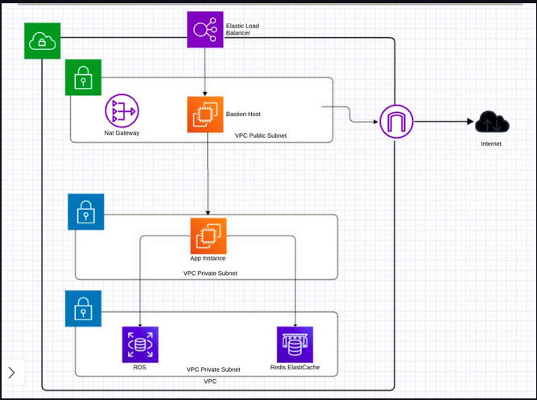
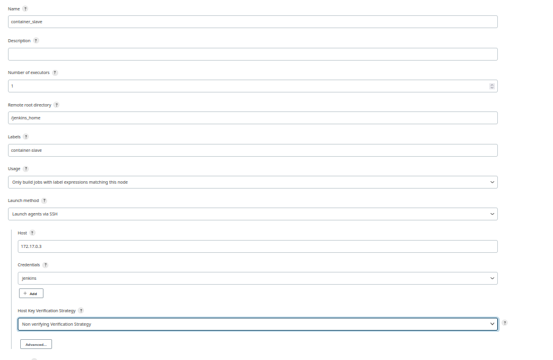
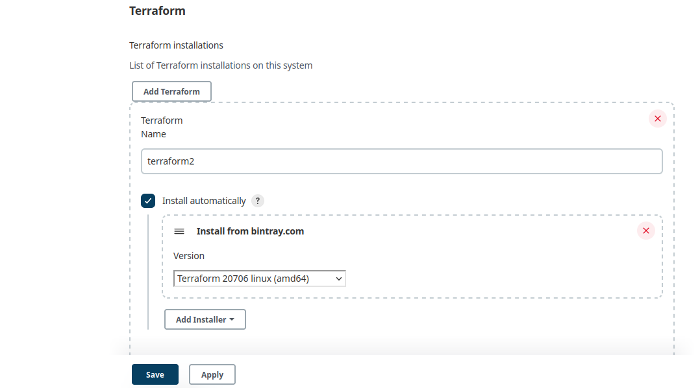
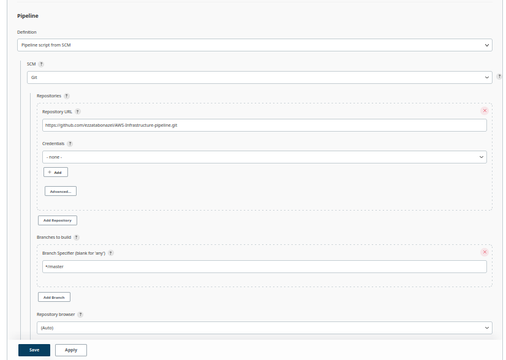
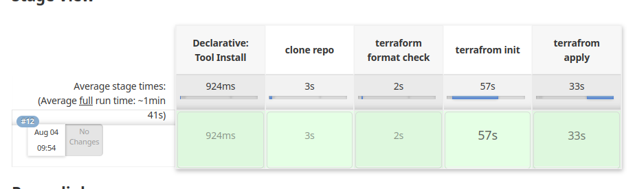
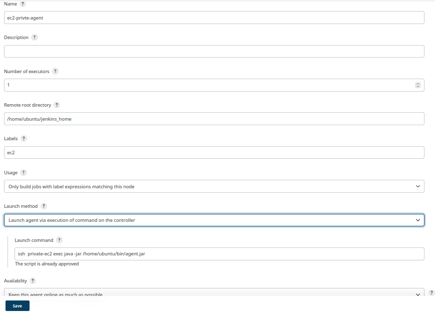
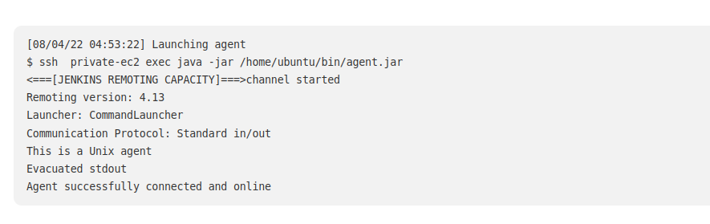
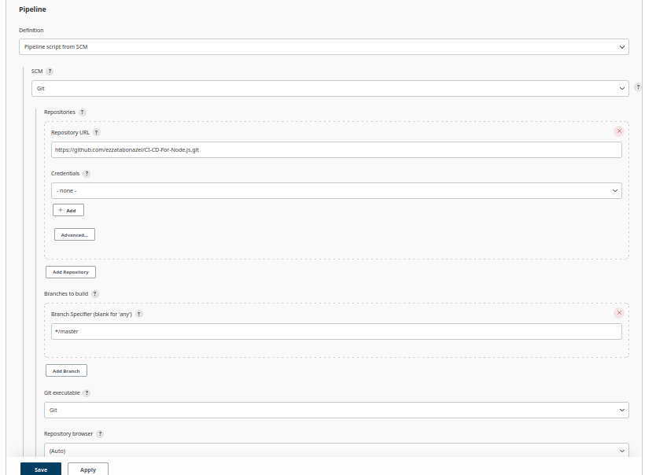
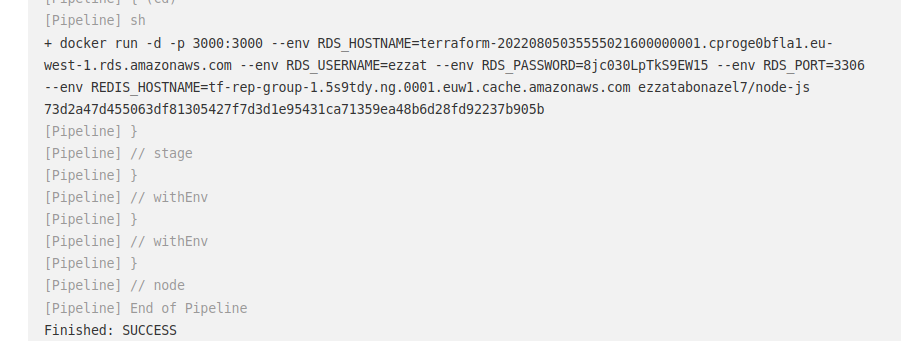
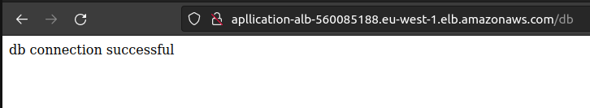

# AWS Infrastructure Pipeline and CI-CD NodeJS-app 

## Architecture


## Description

Using Jenkins pipeline, building VPC with public and private subnets. The public subnet has a bastion host, using to be a proxy server. One of the private subnets has a private instance, configured with Ansible, to be a Jenkins Slave to run on it a Node.js app that connects to an RDS and an ElastiCache Redis instances in another private subnet. 

# Steps to implement

## 1- Deploying Jenkins Master

deploy a Jenkins master as a container on your local machine :

```bash
#build jenkins image with docker customization
$ docker build . -t jenkins-docker:latest -f jenkins/jenkins-docker

$ docker run -d -it -p 8080:8080 -v /var/run/docker.sock:/var/run/docker.sock jenkins-docker:latest
```
Then type in your browser, and follow steps to configure startup wizard :

```
http://localhost:8080
```

### Jenkins Slave as a container

To deploy a Jenkins slave as a container on your local machine :
```bash
$ docker build  -t jenkins-slave:latest -f jenkins/slave_dockerfile

$ docker run -d -it -v /var/run/docker.sock:/var/run/docker.sock jenkins-slave:latest
```
Then, go to the Jenkins page and configure it as follows:

- go to "Manage Jankins". Then choose "Manage Nodes and Clouds". From there choose "New Node".

- create a credential of type: SSH Username with private key -> with name: jenkins and your own private key (public key has to be on the container)

- configure it as follows:
<p align='center'>

</p>

- Finally, save and press "launch agent"
- Note: always make sure the ssh service is running
```bash
$ docker exec -it -u root CONTAINER_ID bash
$ service ssh start
```

## 2- Running Infrastructure Pipeline
### Prequisites:

For AWS :
- install  "Amazon Web Services SDK :: All" plugin
- install "Pipeline: AWS Steps" to allow jenkins pipeline steps interact with AWS APIs and create AWS credentials
- Create a credential of type "aws credentials" with 'Access Key ID' and 'Secret Access Key' of your IAM user
 
For Terraform 
- - Install the "Terraform" plugin and configure under "Manage Jenkins" and "Global Tool Configuration" as follows:

<p align='center'>

</p>

- Note: verify that terraform version is compatible with your OS


## 3- create a New Item

- configure it as follows:
<p align='center'>

</p>

- Press 'save' and 'Build Now'  the pipeline

<p align='center'>

</p>

## 4- private EC2 to be Jenkins slave

### With Ansible 
- GO to secrets Manager retrive the private key and save it in <key.pem>
- Get the bastion public ip and application Ec2 private ip and insert them in hosts file
```
[bastion]
18.203.249.117
[slave]
10.0.0.202

[slave:vars]
ansible_ssh_common_args='-o ProxyCommand="ssh -p 22 -W %h:%p -q ubuntu@bastion"'
ansible_ssh_user=ubuntu

```
- Run Ansible playbook as follows :
```bash
$ ansible-playbook --private-key <key.pem> ec2-playbook.yaml
$ ansible-playbook --private-key <key.pem> docker-playbook.yaml

```
### From Jenkins Master
- configre ssh ProxyJump to use bastion to connect to private EC2 
```bash
$ docker exec -it <CONTAINER-ID> bash
$ cd /var/jenkins_home
$ mkdir /.ssh 
$ exit
```
* create ssh  config as 
```
Host bastion
   User ubuntu
   Hostname <public-ip>
   identityFile /var/jenkins_home/.ssh/<key.pem>

Host private-ec2
   Hostname <private-ip>
   ProxyJump bastion
   user  ubuntu
   identityFile /var/jenkins_home/.ssh/<key.pem>

```
* copy ssh config and private key 
```bash 
$ docker cp ssh_config <CONTAINER-ID>:/var/jenkins_home/config
$ docker cp <key.pem> <CONTAINER-ID>:/var/jenkins_home/<key.pem>

```

- From Web Page Under "Manage Nodes and Clouds", choose to create a "New Node", give it a name and configure it as follows:

<p align='center'>

</p>

* Command used to connect is:

```bash
$ ssh  private-ec2 exec java -jar /home/ubuntu/bin/agent.jar
```
Press 'save' and 'launch agent'

<p align='center'>

</p>

# CI-CD For NodeJS-app 

## Description

Using Jenkins pipeline, deploying a node.js application on a Jenkins slave (private EC2 instance) which also serves to test your application's connectivity to RDS and ElastiCache instances.

## Steps:
### 1- Prequisites:
- Make sure you have a Jenkins Slave EC2 instance online and running successfully

- Create a credential for your dockerhub account of type (username and password)

- Edit the Jenkinsfile to include the endpoints of both your RDS and ElastiCache instances 

### 2- Creating and Running Pipeline:
- Create a pipeline as follows:
<p align='center'>

</p>

- Then press 'save' and 'Build Now'

<p align='center'>

</p>


### 3- create ALB with terraform to Expose the Node-js:

### 4- Test your application:

- you can do one of the following:

- You test using the ALB :
    ```
    http://ALB_ENDPOINT/
    http://ALB_ENDPOINT/db
    http://ALB_ENDPOINT/redis
    ```
 - In case above options are not available, then you can ssh into the Jenkins slave, and curl:

    ```bash
    $ curl http://localhost:3000
    $ curl http://localhost:3000/db
    $ curl http://localhost:3000/redis
    ```

### Finally:
---
<p align='center'>

</p>

<p align='center'>

</p>


## Tools
<p align="center">


</p>

